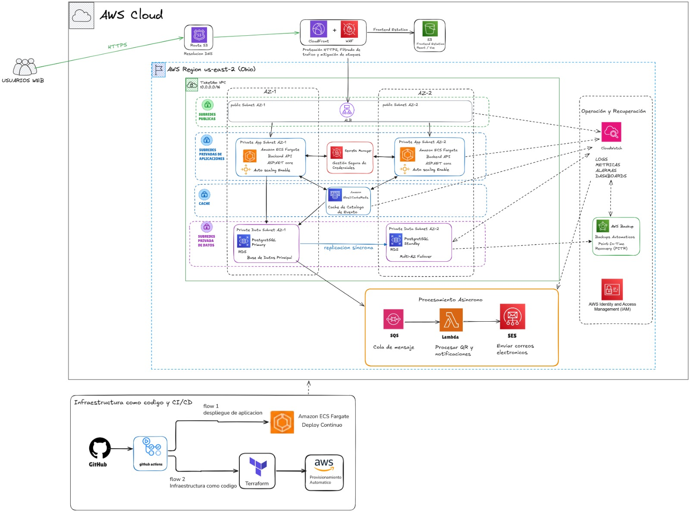
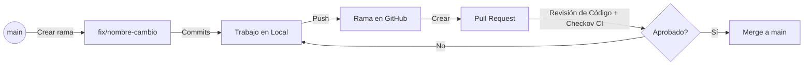

# TicketGo Perú 🎫

Plataforma de venta y distribución de entradas para eventos masivos, desarrollada con una arquitectura **Cloud Native** sobre **Amazon Web Services (AWS)**. El proyecto implementa un backend moderno en **.NET 8**, un frontend interactivo en **React + Vite** e infraestructura declarativa con **Terraform**, siguiendo las mejores prácticas del **AWS Well-Architected Framework**.

---

##  Índice
1. [Introducción](#introducción)
2. [Características principales](#características-principales)
3. [Arquitectura del Sistema](#arquitectura-del-sistema)
4. [Tecnologías y Herramientas](#tecnologías-y-herramientas)
5. [Estructura del Proyecto](#estructura-del-proyecto)
6. [Requisitos Previos](#requisitos-previos)
7. [Configuración del Ambiente](#configuración-del-ambiente)
8. [Variables de Entorno](#variables-de-entorno)
9. [Cómo Ejecutar el Backend](#cómo-ejecutar-el-backend)
10. [Cómo Ejecutar el Frontend](#cómo-ejecutar-el-frontend)
11. [Despliegue de Infraestructura (Terraform)](#despliegue-de-infraestructura-terraform)
12. [Análisis de Seguridad (Checkov)](#análisis-de-seguridad-checkov)
13. [Flujo de Trabajo Git](#flujo-de-trabajo-git)
14. [Convención de Ramas](#convención-de-ramas)
15. [Convención de Commits](#convención-de-commits)
16. [Integrantes](#integrantes)
17. [Roadmap (Futuras Mejoras)](#roadmap-futuras-mejoras)
18. [Licencia](#licencia)

---

##  Introducción

**TicketGo Perú** es una solución diseñada para soportar altos picos de demanda durante la venta de entradas para eventos populares ("hot-sale"). A través del uso de servicios administrados y serverless de AWS, garantizamos alta disponibilidad, tolerancia a fallos, desacoplamiento de componentes y escalabilidad automática sin incurrir en altos costos de mantenimiento operacional.

---

##  Características principales

- **Compra Desacoplada**: El proceso de registro y pago de entradas es asíncrono, utilizando colas de mensajería para evitar la sobrecarga de la base de datos durante eventos masivos.
- **Seguridad en Capas**: Protección perimetral con AWS WAF, cifrado de datos en tránsito (TLS 1.2) y en reposo (KMS), administración segura de credenciales con Secrets Manager.
- **Despliegue Contenedorizado**: API modular corriendo bajo AWS ECS Fargate, libre de administración de servidores físicos.
- **Procesamiento Serverless**: Generación y envío asíncrono de comprobantes de pago y códigos QR mediante funciones AWS Lambda y Amazon SES.
- **Infraestructura como Código (IaC)**: Definición completa del ambiente AWS parametrizada con Terraform para garantizar despliegues replicables.

---

##  Arquitectura del Sistema

El siguiente diagrama detalla la arquitectura de nube e integración de servicios:



---

## 🛠️ Tecnologías y Herramientas

### Backend
| Tecnología | Versión | Uso / Descripción |
| :--- | :--- | :--- |
| **.NET** | 8.0 | Runtime principal y framework de desarrollo |
| **ASP.NET Core Web API** | 8.0 | Creación de endpoints RESTful y controladores |
| **Entity Framework Core** | 8.0 | ORM para mapeo objeto-relacional e interacción SQL |
| **PostgreSQL** | 16 | Motor de base de datos relacional principal |
| **JWT** | 8.0 (System.IdentityModel) | Autenticación y autorización basada en tokens seguros |
| **BCrypt.Net** | 4.0.3 | Cifrado unidireccional y hashing de contraseñas |

### Frontend
| Tecnología | Versión | Uso / Descripción |
| :--- | :--- | :--- |
| **React** | 19.x | Biblioteca para la construcción de interfaces de usuario |
| **Vite** | 8.x | Herramienta de compilación rápida para frontend |
| **ESLint** | 10.x | Linter para asegurar la calidad y consistencia del código JS/React |

### Infraestructura (AWS & IaC)
| Servicio/Herramienta | Versión / Tipo | Uso / Descripción |
| :--- | :--- | :--- |
| **Terraform** | >= 1.5.0 | Aprovisionamiento e infraestructura declarativa como código |
| **AWS ECS Fargate** | Serverless Containers | Ejecución del contenedor API con autoescalado |
| **AWS ALB** | Application Load Balancer | Balanceo de carga y enrutamiento inteligente del tráfico HTTP |
| **Amazon ECR** | Elastic Container Registry | Registro privado de imágenes de contenedor de Docker |
| **Amazon SQS** | Standard Queue | Desacoplamiento del flujo de procesamiento de notificaciones |
| **AWS Lambda** | Node.js 20.x | Procesamiento y generación de correos electrónicos en background |
| **Amazon S3** | Simple Storage Service | Hosting de activos estáticos del frontend React |
| **Amazon CloudFront** | CDN | Distribución de contenido global con baja latencia |
| **AWS WAF** | Web Application Firewall | Bloqueo de ataques maliciosos comunes (OWASP Top 10) |
| **AWS Secrets Manager** | Key/Value Store | Rotación y almacenamiento de cadenas de conexión y claves JWT |
| **Amazon SES** | Simple Email Service | Distribución masiva de correos transaccionales |
| **AWS Backup** | Centralized Backup | Automatización de respaldos periódicos de la base de datos |
| **Amazon CloudWatch** | Logs & Metrics | Centralización de registros y monitoreo de salud del sistema |

### DevOps & Calidad
| Herramienta | Uso / Descripción |
| :--- | :--- |
| **Docker Desktop** | Contenedorización de la API y levantamiento de base de datos local |
| **Git & GitHub** | Sistema de control de versiones y almacenamiento del repositorio |
| **GitHub Actions** | Automatización de pipelines CI/CD (Construcción, Test y Despliegue) |
| **Checkov** | Analizador estático de seguridad para código de Terraform (IaC SAST) |

---

##  Estructura del Proyecto

El repositorio está organizado por componentes limpios y separados:

```
ticketgo-aws/
├── backend/                  # Código fuente de la API (.NET 8)
│   ├── Helpers/              # Clases utilitarias globales (p.ej. respuestas estándar)
│   └── TicketGo.Api/         # Proyecto Web API principal
│       ├── Configuration/    # Clases de configuración de servicios e inyección
│       ├── Controllers/      # Controladores REST que exponen los endpoints
│       ├── DTOs/             # Objetos de transferencia de datos de entrada/salida
│       ├── Data/             # Contexto de base de datos (DbContext) y configuración de tablas
│       ├── Entities/         # Modelos del dominio del negocio
│       ├── Interfaces/       # Abstracciones y contratos de servicios
│       ├── Mappings/         # Mapeos de DTOs a Entidades y viceversa
│       ├── Middlewares/      # Manejo global de excepciones y seguridad
│       ├── Migrations/       # Historial de migraciones de base de datos (EF Core)
│       ├── Services/         # Implementaciones lógicas del negocio (QR, Compras, etc.)
│       └── Dockerfile        # Archivo para compilar la imagen de contenedor del backend
├── frontend/                 # Código fuente del cliente web
│   └── ticketgo-web/         # Aplicación SPA estructurada con React + Vite
│       ├── public/           # Activos públicos estáticos
│       └── src/              # Componentes de UI, estilos y lógica del cliente
└── infra/                    # Infraestructura como Código (IaC)
    └── terraform/            # Scripts declarativos en Terraform HCL
        ├── lambda/           # Código fuente del procesador de notificaciones (.mjs)
        ├── *.tf              # Módulos de infraestructura separados por servicio
        └── variables.tf      # Definición de variables parametrizables
```

---

##  Requisitos Previos

Antes de configurar tu ambiente local, asegúrate de tener instalados los siguientes componentes:

| Herramienta | Versión Recomendada | Comando para Verificar |
| :--- | :--- | :--- |
| **Git** | >= 2.40.0 | `git --version` |
| **.NET SDK** | 8.0.x | `dotnet --version` |
| **Node.js** | >= 20.x | `node --version` |
| **Docker / Docker Desktop** | >= 24.x | `docker --version` |
| **Terraform CLI** | >= 1.5.0 | `terraform --version` |
| **AWS CLI v2** | >= 2.11.0 | `aws --version` |

---

##  Configuración del Ambiente

### 1. Clonar el repositorio
```bash
git clone https://github.com/Anthony-Gaytan/ticketgo-aws.git
cd ticketgo-aws
```

### 2. Configurar credenciales AWS localmente
Configura tu perfil de AWS utilizando tus credenciales de IAM de desarrollo:
```bash
aws configure --profile anthony-admi
# Ingresa tu AWS Access Key ID
# Ingresa tu AWS Secret Access Key
# Default region name: us-east-2
# Default output format: json
```

### 3. Iniciar Docker Desktop
Asegúrate de que el motor de Docker esté activo:
```bash
# Verificar conectividad con Docker
docker info
```

### 4. Inicializar Terraform
Navega a la carpeta de infraestructura y descarga el proveedor de AWS:
```bash
cd infra/terraform
terraform init
cd ../..
```

---

##  Variables de Entorno

Para levantar el proyecto localmente y desplegar en la nube, debes configurar los siguientes archivos. **Nunca almacenes secretos reales en el control de versiones.**

### Frontend (`frontend/ticketgo-web/.env.example`)
Crea un archivo `.env` en `frontend/ticketgo-web/` con los siguientes valores:
```env
# URL de la API del Backend (Local o AWS ALB)
VITE_API_URL=http://localhost:8080
VITE_APP_ENV=development
```

### Backend (`backend/TicketGo.Api/appsettings.Development.json`)
Este archivo ya existe en tu entorno de desarrollo para correr localmente:
```json
{
  "Jwt": {
    "Key": "ESTA_ES_UNA_CLAVE_SECRETA_MUY_LARGA_PARA_TICKETGO_2026",
    "Issuer": "TicketGo.Api",
    "Audience": "TicketGo.Client",
    "DurationInMinutes": 120
  },
  "ConnectionStrings": {
    "DefaultConnection": "Host=localhost;Port=5432;Database=ticketgo_db;Username=postgres;Password=YOUR_SECURE_PASSWORD"
  },
  "Logging": {
    "LogLevel": {
      "Default": "Information",
      "Microsoft.AspNetCore": "Warning"
    }
  }
}
```

### Terraform (`infra/terraform/terraform.tfvars.example`)
Crea un archivo `terraform.tfvars` en `infra/terraform/` configurando tus parámetros específicos:
```hcl
aws_region         = "us-east-2"
aws_account_id     = "329871097383"
project_name       = "ticketgo"
environment        = "dev"
container_port     = 8080
ecr_image_tag      = "v1"
ecs_cpu            = "256"
ecs_memory         = "512"
log_retention_days = 7
db_name            = "ticketgo_db"
db_username        = "ticketgo_admin"
db_instance_class  = "db.t3.micro"
rds_multi_az       = false
ses_email_identity = "tu-correo-remitente@dominio.com"
```

---

##  Cómo Ejecutar el Backend

### Ejecución Local Directa (.NET CLI)

1. Levantar una base de datos PostgreSQL local en Docker para pruebas:
```bash
docker run --name ticketgo-postgres -e POSTGRES_PASSWORD=YOUR_SECURE_PASSWORD -e POSTGRES_DB=ticketgo_db -p 5432:5432 -d postgres:16
```

2. Restaurar paquetes NuGet:
```bash
cd backend/TicketGo.Api
dotnet restore
```

3. Aplicar migraciones a la base de datos local:
```bash
dotnet ef database update
```

4. Ejecutar la API en modo de desarrollo:
```bash
dotnet run
# La API se levantará por defecto en http://localhost:5258 o https://localhost:7189
```

### Ejecución usando Docker (Contenedor)

1. Compilar la imagen Docker localmente:
```bash
cd backend/TicketGo.Api
docker build -t ticketgo-api .
```

2. Ejecutar el contenedor mapeando el puerto de desarrollo:
```bash
docker run -d -p 8080:8080 --name ticketgo-api-instancia ticketgo-api
```
3. Probar el estado de salud de la API local:
```bash
curl http://localhost:8080/health
```

---

##  Cómo Ejecutar el Frontend

1. Navegar al directorio del frontend:
```bash
cd frontend/ticketgo-web
```

2. Instalar las dependencias de Node.js:
```bash
npm install
```

3. Levantar el servidor de desarrollo local de Vite:
```bash
npm run dev
# La aplicación abrirá una interfaz local típicamente en http://localhost:5173
```

---

##  Despliegue de Infraestructura (Terraform)

Para desplegar el ecosistema completo en AWS, sigue esta secuencia en la carpeta `infra/terraform`:

```bash
cd infra/terraform
```

### 1. Inicializar
Descarga los plugins e inicia el backend de almacenamiento local o remoto:
```bash
terraform init
```

### 2. Planificar
Genera y visualiza la bitácora de ejecución de recursos para verificar qué cambios se aplicarán:
```bash
terraform plan
```

### 3. Aplicar
Despliega y aprovisiona físicamente la arquitectura de red, ECS y bases de datos en AWS (Aprobación requerida):
```bash
terraform apply
```

### 4. Destruir
Cuando ya no requieras el uso de los recursos activos en la nube para evitar cobros innecesarios:
```bash
terraform destroy
```

---

##  Análisis de Seguridad (Checkov)

Checkov es un analizador estático para identificar malas prácticas y vulnerabilidades de seguridad en el código de Terraform. Se ejecuta de manera local dentro de un contenedor Docker para no requerir instalaciones de Python en tu sistema.

Para auditar el directorio de Terraform completo y ver todos los hallazgos:

```bash
# Ejecutar Checkov utilizando volumen de Docker y apuntando al directorio de Terraform
docker run --rm -v "C:/Users/Antho/Documents/IAC/ticketgo-aws/infra/terraform:/tf" bridgecrew/checkov:3 --directory /tf
```

> [!NOTE]
> Para filtrar o ignorar ciertas reglas en el análisis estático temporalmente, puedes pasar el parámetro `--skip-check` o usar comentarios directos en los recursos de Terraform (ej: `#checkov:skip=CKV_AWS_103:Deshabilitar HTTPS solo para fines de demo local`).

---

## Flujo de Trabajo Git

El equipo trabaja bajo una metodología estructurada de **Git Flow simplificada**. El código no se sube directamente a la rama productiva; todo cambio debe pasar por revisión por pares.



### Proceso de Integración
1. Crear una rama a partir de `main` con el prefijo de feature o fix.
2. Desarrollar y validar localmente (incluyendo Checkov).
3. Hacer `push` de la rama hacia el repositorio remoto en GitHub.
4. Crear un **Pull Request (PR)** hacia la rama `main`.
5. Pasar por un proceso de **Code Review** por al menos un integrante del equipo.
6. Una vez aprobados los tests automáticos y la revisión, realizar el **Merge** final.

---

##  Convención de Ramas

Para mantener la trazabilidad de qué desarrollador y qué cambio se está realizando, las ramas deben seguir la estructura `[tipo]/[nombre]-[descripcion-corta]`.

Ejemplos aprobados para el equipo:
- `fix/anthony-checkov-sqs-encryption`
- `fix/fernando-checkov-ecr-immutability`
- `fix/pierre-checkov-ecs-container-insights`

---

##  Convención de Commits

Seguimos el estándar de **Conventional Commits** para generar un historial de versiones legible y automatizable.

### Formato General
```
<tipo>: <descripción corta en minúsculas y presente>
```

### Tipos de Commits Comunes
- `feat`: Nueva funcionalidad para el usuario final (ej. `feat: agregar integracion de compras asincronas con sqs`).
- `fix`: Solución a un error o vulnerabilidad de seguridad (ej. `fix: habilitar encriptado kms para colas sqs`).
- `refactor`: Cambios en el código fuente que no corrigen errores ni añaden funcionalidades (ej. `refactor: separar recursos terraform por servicios`).
- `docs`: Modificaciones exclusivas en documentación (ej. `docs: actualizar readme con guia de instalacion local`).

---

## Integrantes

A continuación se detalla la tabla del equipo del proyecto.

<!-- NOTA: Completar con la información de contacto y roles oficiales del equipo de desarrollo. -->

| Nombre | Rol | GitHub | Contacto / Email |
| :--- | :--- | :--- | :--- |
| Anthony Gaytan | Solutions Architect / Dev / DevOps | [@Anthony-Gaytan](https://github.com/Anthony-Gaytan) | 
| Fernando https://github.com/fernandoo89 | Backend & Cloud Developer | *[Completar]* | *[Completar]* |
| Pierre https://github.com/Piers22 | Frontend Developer | *[Completar]* | *[Completar]* |

---

##  Roadmap (Futuras Mejoras)

- [ ] **Fase 3**: Integración completa con AWS Secrets Manager para inyección dinâmica de tokens JWT y strings de conexión a base de datos.
- [ ] **Fase 4**: Aprovisionamiento automático de bases de datos relacionales administradas con AWS RDS PostgreSQL.
- [ ] **Fase 5**: Hosting estático del frontend React en Amazon S3 integrado con la red de entrega global Amazon CloudFront y WAF.
- [ ] **Fase 6**: Configuración del motor de correos de Amazon SES para notificaciones de compra en producción.
- [ ] **Fase 7**: Configuración de backups centralizados automáticos y políticas de retención con AWS Backup.

---

##  Licencia

Este proyecto está bajo la Licencia **MIT**. Para más detalles, lee el archivo `LICENSE` (si se encuentra disponible en el repositorio).
